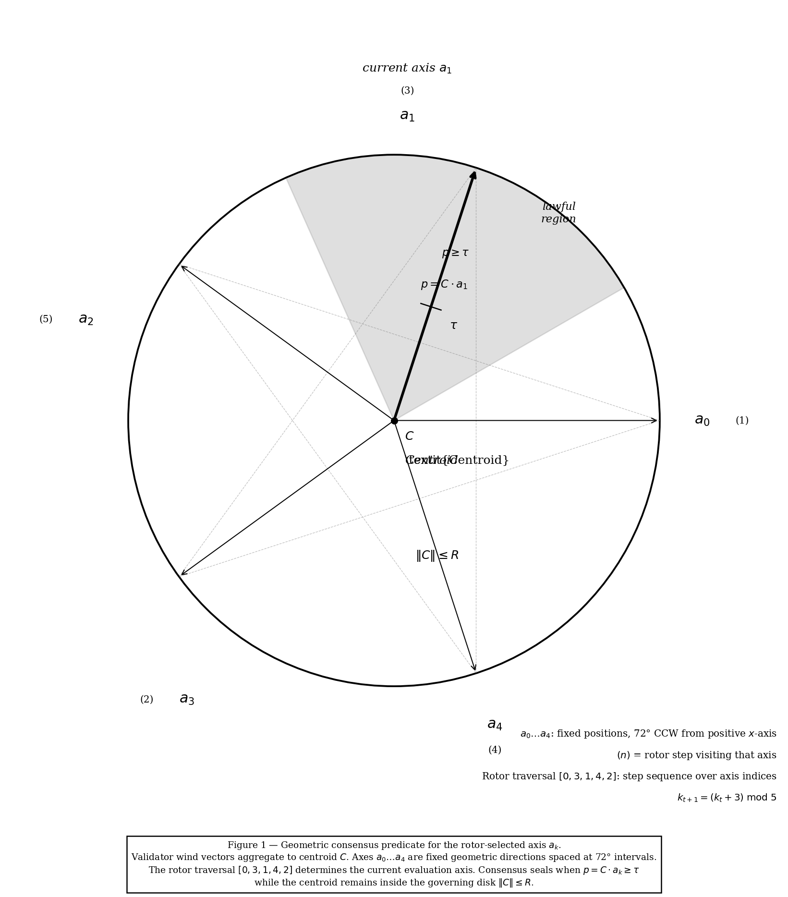

# SevenFold  
<p align="center">
  
</p>

> *Validator wind vectors aggregate to centroid C. Rotor traversal
> [0, 3, 1, 4, 2] selects the evaluation axis. Consensus seals
> when p = C · aₖ ≥ τ while ‖C‖ ≤ R.*

---

### A Deterministic Geometric Proof of Consensus  

**SevenFold** introduces a new class of deterministic consensus: one that converges through **geometric structure rather than probability, randomness, timing assumptions, or leader election**.

This work demonstrates that bounded deterministic agreement is achievable without entropy-based mechanisms, addressing limitations long assumed by classical consensus theory.

SevenFold is presented as a **Proof of Consensus (PoC)** — a geometric decision engine that produces agreement through structure, symmetry breaking, and bounded evaluation rather than stochastic processes.

---

## What Problem This Solves

For decades, distributed systems have relied on probabilistic techniques to overcome the impossibility of deterministic agreement under contention. As a result, modern consensus systems depend on randomness, stake weighting, leader selection, or timing assumptions.

SevenFold shows that these assumptions are not strictly necessary.

By modeling consensus as a geometric convergence problem, SevenFold demonstrates that agreement can be reached deterministically in a bounded number of steps — without relying on probability or trust-weighted influence.

---

## Publications

### Latest (February 2026)

**Mathematical Foundations**  
Harmonic Field Geometry: Axiomatic Foundations of Coprime Convergence  
📄 [DOI: 10.5281/zenodo.18807891](https://doi.org/10.5281/zenodo.18807891)

**Protocol Whitepaper v3.0**  
SevenFold: A Deterministic Geometric Consensus Protocol  
📄 [DOI: 10.5281/zenodo.18807475](https://doi.org/10.5281/zenodo.18807475)

### Canonical Specifications (2025)

**Primary Protocol**  
📄 [DOI: 10.5281/zenodo.17914272](https://doi.org/10.5281/zenodo.17914272)

**Canonical Definitions**  
📄 [DOI: 10.5281/zenodo.17940111](https://doi.org/10.5281/zenodo.17940111)

**Specification v2.0**  
📄 [DOI: 10.5281/zenodo.17970561](https://doi.org/10.5281/zenodo.17970561)

---

## What SevenFold Is  

SevenFold models consensus as a geometric process composed of:

- Independent participant inputs (“winds”)
- A convex centroid representing collective agreement
- A deterministic harmonic rotor defined over a finite cyclic group
- A bounded lawfulness evaluator (“governing disk”)

Together, these components form a deterministic decision engine that converges in a guaranteed maximum number of rotor cycles.

This approach reframes consensus as **geometry plus structure**, rather than voting, randomness, or leader control.

---

## What This Repository Represents  

This repository serves as:

- A public record of discovery and attribution  
- A reference implementation of the SevenFold consensus model  
- A conceptual foundation for deterministic geometric consensus  

It is **not** a production-ready implementation, nor does it grant unrestricted rights to commercial use.

Detailed optimizations, scaling strategies, and production integrations are intentionally outside the scope of this repository.

---

## Benchmarks & Development Reports
-----------------------------------

| Metric | SevenFold PoC | Ethereum PoS |
|--------|-----------------|--------------|
| Decisions | 20,000 | 10 |
| Total time | 30ms | 127ms |
| Avg decision latency | **2µs** | 12.7ms |
| Final variance | **0.000000** | — |
| Forks | **0** | — |
| Randomness required | **None** | Yes |
| Leader required | **None** | Yes |

> ⚠️ **Important:** The 20,000 decisions / 2µs figure reflects the
> **off-chain arbitration kernel** — pure geometric computation
> (centroid + rotor + audit). On-chain EVM state mutation adds
> ~9.63ms per operation, consistent with standard Ethereum testnet
> behavior. The decision layer is SevenFold's contribution —
> the transport layer is the network's.
>
> *Validated March 2026 — Hardhat + Anvil, 3 independent nodes,
> live on-chain convergence confirmed.*

Full benchmark and development artifacts are in the
[`/reports`](reports/) folder, including side-by-side latency
tests, genesis benchmark notes, and the multi-node PoC
development report. These are illustrative, not a production
deployment guide.


---

Planned Network & SEVN Token (Intent Only)
------------------------------------------

The SevenFold Proof of Consensus is a chain-agnostic protocol. This repository
documents the mathematics, canonical specification, and public benchmarks. It is
_not_ itself a blockchain network or token project.

SevenFold Labs LLC is currently exploring a dedicated SevenFold-powered network
with a native token tentatively referred to as **SEVN** (and related marks such
as **SevnFold**). The intent for such a network would be:

- To serve as the **first canonical production implementation** of the SevenFold
  Proof of Consensus.
- To demonstrate **deterministic, geometric finality** in a live, adversarial
  environment.
- To provide a foundation for **licensed integrations** in AI arbitration,
  robotics, infrastructure, and other safety-critical domains.

Important:

- **No SEVN token or SevenFold mainnet has been launched as of this writing.**
- Nothing in this repository constitutes a token sale, investment offering, or
  solicitation.
- Any future SevenFold/SevnFold network or SEVN token launch will be announced through
  official SevenFold Labs LLC channels and will operate under separate legal and
  technical documentation.
- Any chain or token branding itself as “SevenFold/SevnFold” or “SEVN” without an
  explicit license from SevenFold Labs LLC is **not** affiliated with this
  project, regardless of whether it implements similar mathematics.

This section is provided solely to clarify long-term intent and to distinguish
the foundational protocol work in this repository from any future network or
token that may be built on top of it.

## Intellectual Property & Licensing  

SevenFold is **patent-pending** (provisional filed December 1, 2025).

This work is released under a  
**Creative Commons Attribution–NonCommercial–NoDerivatives 4.0 International (CC BY-NC-ND 4.0)** license.

You are free to:
- Read, study, and cite this work
- Share the material with attribution

You may **not**:
- Use this work for commercial purposes
- Create derivative implementations
- Deploy or integrate SevenFold into production systems without permission

Commercial licensing, collaborations, and authorized implementations are managed by **SevenFold Labs LLC**.

---

Ethical Use, Dual-Use Risk & Restricted Domains

SevenFold is a powerful deterministic arbitration engine. Like
cryptography and other foundational primitives, it is mathematically
neutral but not morally neutral in deployment. Because it can
concentrate decision-making power across many agents, SevenFold Labs
LLC places explicit ethical and field-of-use limits on how this work
may be used.

The public materials in this repository are licensed under
CC BY-NC-ND 4.0 and are intended for research, education, review, and
non-commercial experimentation only. They are not a grant of rights for
production deployment or commercial integration.

### Prohibited Uses (Public License)

By using, studying, or building on this work under the public license,
you agree that you will not apply SevenFold, or any substantial
derivative of it, to:

- Real-time mass surveillance of civilian populations
- Social-scoring / citizen-credit systems used for control or discrimination
- Large-scale behavioral or psychological manipulation targeting populations
- Systems whose primary purpose is population-level coercion, repression,
  or information control

These uses are incompatible with the intent of SevenFold and are
considered out of bounds under any good-faith reading of this project.

### Restricted Domains (License-Only)

Certain domains are recognized as inherently sensitive and are **not**
authorized under the public CC BY-NC-ND 4.0 grant. These include, but
are not limited to:

- Military, defense, and security applications
- Autonomous weapon systems or components of a lethal kill-chain
- High-impact national security or intelligence systems

Any exploration of SevenFold in these areas requires explicit written
approval and a separate license agreement with SevenFold Labs LLC.
Such licenses, if ever granted, may be narrowly scoped, audited, and
revocable, and may restrict use to strictly defensive or safety-oriented
roles.

### Intent

SevenFold is intended for applications that enhance safety, stability,
reliability, and human dignity — for example in robotics, infrastructure,
energy systems, AI arbitration, sensor fusion, and other safety-critical
domains.

All production or commercial use of SevenFold must go through a
licensing process with SevenFold Labs LLC and may be refused or
terminated on ethical grounds at the sole discretion of SevenFold Labs LLC.
This ethical stance is in addition to, and not a replacement for, the
underlying legal license.

---

## Attribution  

**Inventor & Author**  
Adrian John Weddington  
SevenFold Labs LLC  

---

## Status

✅ Formal proofs published — Zenodo (Feb 2026)
✅ Provisional patent filed — Dec 1, 2025
✅ Multi-node convergence validated — 3 nodes, March 2026
✅ Live on-chain convergence confirmed
✅ Solidity (EVM) + Rust (Tokio) implementations complete
🔄 Production SDK — in development
🔄 Public testnet — in development
🔄 AI arbitration wrapper — in development

---

## Contact  

For licensing inquiries, research collaboration, or authorized implementations:

**SevenFold Labs LLC**  
📧 SevenFoldLabs@gmail.com

---

## Citation

If you reference this work, please cite:

```bibtex
@article{weddington2026harmonic,
  title={Harmonic Field Geometry: Axiomatic Foundations of Coprime Convergence},
  author={Weddington, Adrian},
  journal={Zenodo},
  year={2026},
  doi={10.5281/zenodo.18807891}
}

@techreport{weddington2026sevenfold,
  title={SevenFold: A Deterministic Geometric Consensus Protocol},
  author={Weddington, Adrian},
  institution={SevenFold Labs LLC},
  year={2026},
  doi={10.5281/zenodo.18807474}
}

---

## Intellectual Property Notice

SevenFold is a patent-pending deterministic consensus protocol.
All rights are reserved by SevenFold Labs LLC.

This repository is published for research, review, and citation purposes only.
Commercial use or derivative works require explicit written permission.
